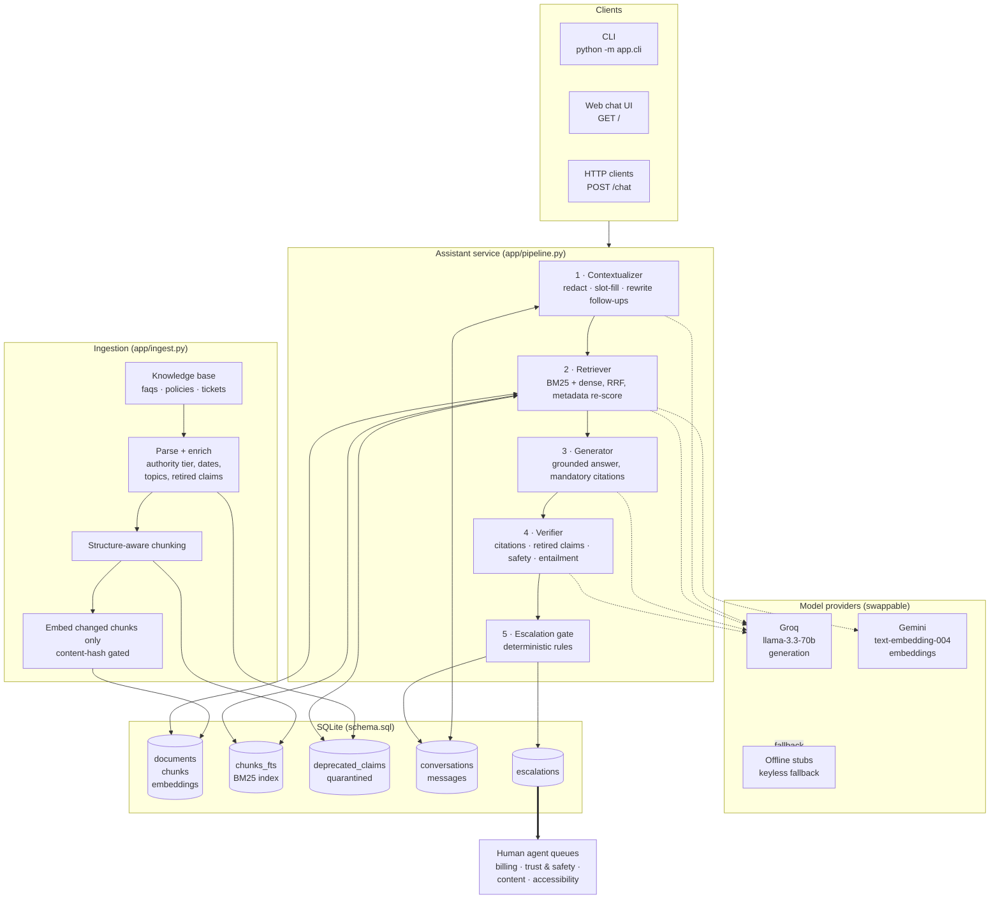
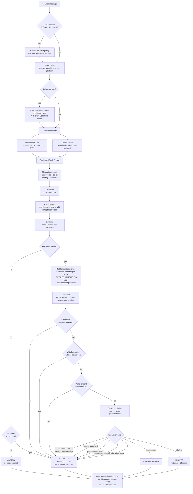
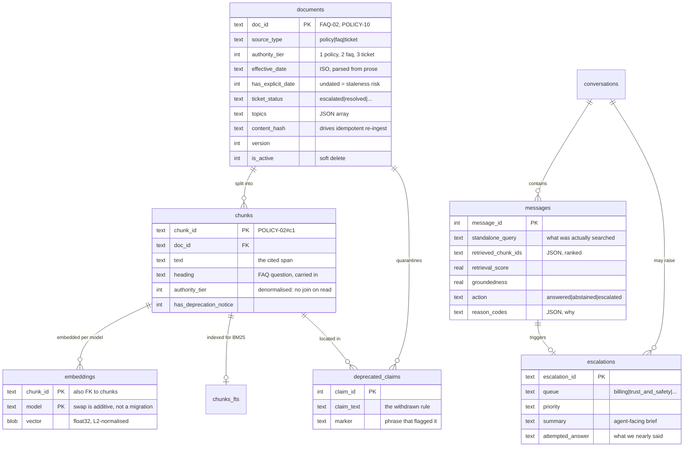
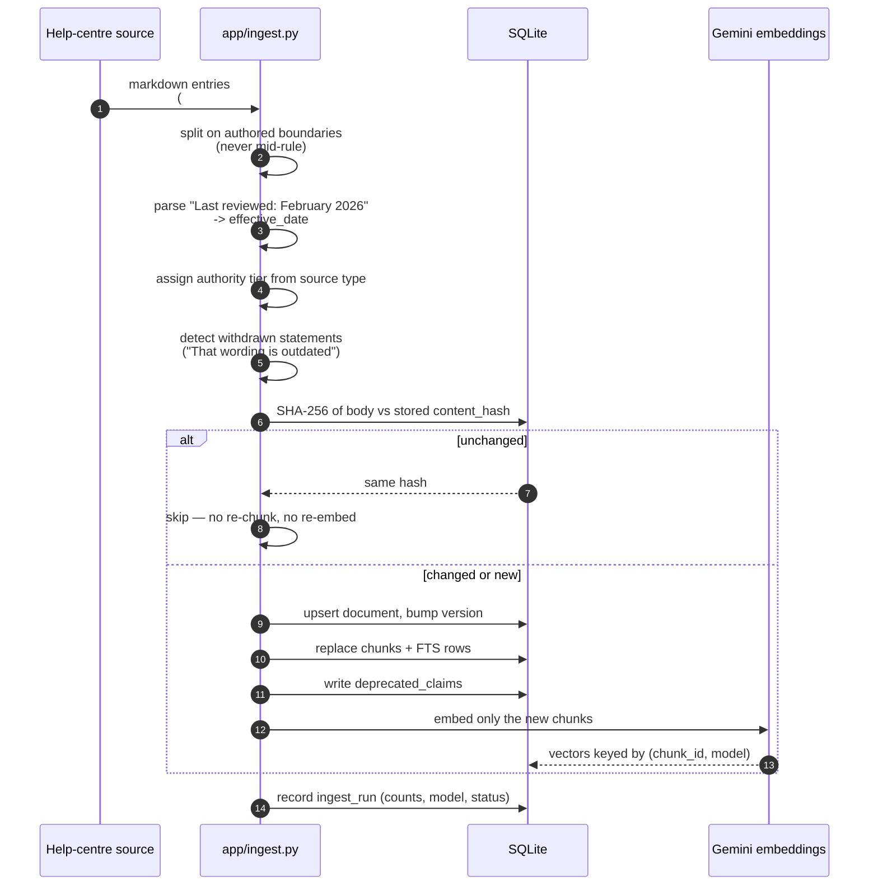

# System Design

All diagrams are Mermaid and render natively on GitHub.

---

## 1. High-level architecture

**The shape of the argument.** Retrieval and generation are the easy half. The
half that decides whether this is safe to put in front of learners is
everything after the arrow out of `Generator`: an independent verification
pass, and a gate made of plain Python rules rather than model self-assessment.

---

## 2. How a query flows end to end

### The three failure families the gate encodes

| Family | Trigger | Action |
|---|---|---|
| **I could not find it** | empty retrieval, `top_score` under the floor, no rank separation | abstain if out-of-domain, escalate if the learner is asking about their account |
| **I do not trust what I produced** | invalid citation, retired-claim leak, unsafe request, groundedness under 0.70, model unavailable | escalate — never show the answer |
| **This is not a bot's decision** | fraud, duplicate charge, account ownership, refund dispute, legal, explicit request for a human, repeated failure | escalate regardless of confidence |

Staleness is deliberately *not* in this table. A source that has not been
reviewed recently earns a caveat and a note to the content team, not a refusal.

---

## 3. Data model

Full column-by-column commentary is in [DATA_SCHEMA.md](DATA_SCHEMA.md); the
executable definition is [`schema.sql`](../schema.sql).

---

## 4. Ingestion and freshness

Because ingest is content-hashed and idempotent, `POST /ingest` is safe to run
on a cron or fire from a CMS webhook. Re-embedding the whole corpus on every
publish is the thing that makes teams stop re-indexing, and a corpus that
stops being re-indexed is how stale answers happen.

---

## 5. What this design is not

Honest limits, stated once here and expanded in the README's trade-offs:

- **Not horizontally scalable as written.** One SQLite file, one process,
  brute-force vector scan. Correct at 66 chunks; wrong at 10⁵.
- **No user or order data.** The assistant reasons about *policy*, never about
  a specific account. That is why every account-specific question escalates
  rather than guessing — there is no system of record behind it.
- **Thresholds are tuned on 37 golden cases.** They are a starting point
  calibrated on a small set, not values earned from production traffic.
- **The entailment judge shares a model family with the generator**, so their
  blind spots correlate. The two deterministic checks exist precisely because
  the judge cannot be the only line of defence.
